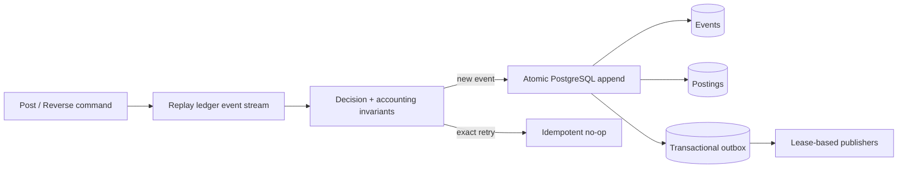

# Karzoun LedgerStream

[](https://github.com/mkarson1997/karzoun-ledgerstream/actions/workflows/ci.yml)
[](https://github.com/mkarson1997/karzoun-ledgerstream/actions/workflows/codeql.yml)
[](https://github.com/mkarson1997/karzoun-ledgerstream/releases)
[](LICENSE)

LedgerStream is a Java 21 event-sourced double-entry ledger engine focused on accounting invariants, durable PostgreSQL history, idempotent posting, optimistic concurrency, deterministic reconstruction, and transactional outbox delivery.

## Architecture at a glance



The core separates decision logic from persistence: state is reconstructed from immutable history, commands are validated against accounting and idempotency rules, then accepted events, postings and outbox records cross one database transaction boundary.

## Engineering proof points

| Area | What the repository demonstrates |
| --- | --- |
| Accounting correctness | Per-currency double-entry balancing with `BigDecimal`, positive amounts and explicit debit/credit sides. |
| Event sourcing | Immutable history, deterministic replay and append-only reversals instead of historical mutation. |
| Idempotency | Payload-bound idempotency where exact retries return the original result and changed reuse is rejected. |
| Concurrency | Expected-version optimistic concurrency enforced in PostgreSQL. |
| Transactional integrity | Stream version, event, postings and outbox commit or roll back together. |
| Reliable delivery | Bounded outbox claims with leases, ownership checks and `FOR UPDATE SKIP LOCKED`. |
| Integration evidence | Testcontainers exercises restart reconstruction, rollback, ownership, concurrency and accounting behavior against real PostgreSQL. |
| Compatibility | CI verifies Java 21 and Java 25. |
| Security analysis | CodeQL Java/Kotlin runs with `security-extended` queries. |
| Supply-chain security | Third-party GitHub Actions are pinned to reviewed immutable commit SHAs. |
| Distribution | Versioned JAR + sources, CycloneDX SBOM, SHA-256 manifest and GitHub Maven package. |

## v0.1.0 scope

Implemented and tested now:

- immutable double-entry journal entries
- per-currency debit/credit balancing with `BigDecimal` only
- payload-bound idempotency: exact retry is a no-op, changed payload under the same key is rejected
- deterministic entry identity for retried commands
- append-only reversals instead of historical mutation
- deterministic aggregate reconstruction from persisted event history
- accounting-period policy boundary
- PostgreSQL event store managed by Flyway
- SQL expected-version optimistic concurrency
- event + postings + outbox committed in one database transaction
- unique event/entry/idempotency constraints as defense in depth
- durable outbox leases with bounded claims and `FOR UPDATE SKIP LOCKED`
- restart reconstruction, rollback, outbox ownership, concurrency, accounting, and idempotency tests
- Java 21/25 CI, PostgreSQL Testcontainers integration, and CodeQL Java/Kotlin

## Accounting invariant

Every represented currency balances independently:

```text
sum(debits, currency) == sum(credits, currency)
```

A USD debit cannot be balanced by an EUR credit. Posting amounts are positive decimal values and are never represented with binary floating point.

## Idempotency

The idempotency key is bound to a deterministic request fingerprint reconstructed from the event stream:

1. first request appends one journal event;
2. exact retry returns the original entry ID and appends nothing;
3. reusing the same key with changed payload fails.

The PostgreSQL schema also enforces `(ledger_id, idempotency_key)` uniqueness as defense in depth.

## Reversals

Historical entries are never edited or deleted. A reversal appends a new balanced journal entry with inverted posting sides and a `reversalOf` reference to the original.

## PostgreSQL durability

`PostgresEventStore.appendAtomically(...)` advances the stream version, inserts the event, inserts every posting, and inserts the corresponding outbox message inside one SQL transaction. A stale expected version fails without a partial write.

The Testcontainers suite proves reconstruction through a fresh store instance and forces a database constraint failure after event/posting insertion to verify the transaction rolls back the stream version, event, postings, and outbox together.

## Transactional outbox

`PostgresOutboxRepository` claims unpublished messages using bounded leases and PostgreSQL `FOR UPDATE SKIP LOCKED`. Active claims are disjoint across workers. Publishing and releasing require the current worker to own the lease.

## Build and test

Requires JDK 21+ and Maven 3.9+.

```bash
mvn -B -ntp verify
```

Run the PostgreSQL Testcontainers suite:

```bash
mvn -B -ntp -DskipITs=false verify
```

## Distribution

`v0.1.0` publishes:

- `ledgerstream-0.1.0.jar`
- `ledgerstream-0.1.0-sources.jar`
- CycloneDX JSON SBOM
- `SHA256SUMS.txt`
- GitHub Maven package

No container image is published in v0.1.0 because LedgerStream is currently an engine/library, not a network service. A container becomes meaningful only when a real service runtime exists.

## Security and delivery controls

- Java 21 and Java 25 verification run in CI
- PostgreSQL behavior is exercised with Testcontainers
- CodeQL analyzes Java/Kotlin with `security-extended`
- third-party GitHub Actions are pinned to reviewed immutable commit SHAs
- releases include source artifacts, an SBOM and SHA-256 checksums
- package publishing is tag-driven rather than coupled to ordinary branch pushes

## Architecture

See [`docs/architecture.md`](docs/architecture.md) and [`ROADMAP.md`](ROADMAP.md).

## Non-claims

LedgerStream does not claim to be banking-grade, certified accounting software, or suitable for regulated production use. Those labels require operational, compliance, security, recovery, and jurisdiction-specific evidence beyond this software implementation.

## License

Apache-2.0.
