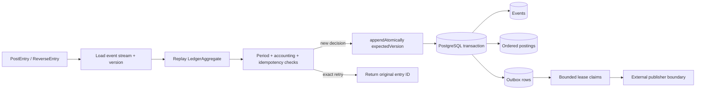

# LedgerStream architecture

LedgerStream treats accounting history as an immutable event stream. Commands are decided against reconstructed state and accepted decisions append new events rather than mutate old records.

## System view



The architecture deliberately keeps the accounting decision model independent from delivery mechanics. PostgreSQL is the durability boundary for both event history and the transactional outbox; transport to an external broker or service remains outside the v0.1.0 core.

## Engineering invariants

| Concern | LedgerStream behavior |
| --- | --- |
| Historical integrity | Accepted accounting history is append-only; reversals add compensating entries rather than edit prior rows. |
| Double-entry correctness | Debits and credits balance independently for every represented currency. |
| Decimal correctness | Monetary amounts use `BigDecimal`; binary floating point is not used for posting amounts. |
| Replay determinism | Aggregate state and idempotency knowledge are reconstructed from persisted event history. |
| Idempotent commands | Exact retries append no event and return the original entry identity; changed payload reuse is rejected. |
| Concurrency | Every append carries an expected stream version and stale writers fail instead of overwriting another decision. |
| Atomicity | Version advance, event metadata, ordered postings and outbox insertion share one SQL transaction. |
| Delivery ownership | Outbox publish/release transitions require ownership of the active lease. |
| Worker concurrency | Claims use bounded batches and `FOR UPDATE SKIP LOCKED` to avoid duplicate active ownership. |
| Schema discipline | Flyway owns PostgreSQL schema evolution and migrations are exercised in integration tests. |
| Verification | CI covers Java 21/25, real PostgreSQL Testcontainers behavior and CodeQL security analysis. |
| Supply chain | Third-party GitHub Actions are pinned to reviewed immutable commit SHAs. |

## Command flow

```text
PostEntry / ReverseEntry
        |
        v
load PostgreSQL event stream + version
        |
        v
replay LedgerAggregate
        |
        v
period policy + accounting invariants + idempotency checks
        |
        v
Decision(events | idempotent no-op)
        |
        v
appendAtomically(expectedVersion, events, outbox)
        |
        v
one PostgreSQL transaction
```

## Double-entry rule

Balancing is checked independently per `CurrencyCode`. Every posting has a positive decimal amount and an explicit `DEBIT` or `CREDIT` side. Multi-currency journal entries therefore require balanced legs for every currency they contain.

## Idempotency

`JournalEntryPosted` persists the request fingerprint. Replay reconstructs the idempotency map from durable history.

- exact retry: return the original entry ID and append zero events
- changed payload under an existing key: reject
- PostgreSQL uniqueness on `(ledger_id, idempotency_key)`: defense in depth against adapter/application defects

## Reversals

A reversal appends a new journal entry with inverted posting sides and a `reversalOf` reference. Original history remains untouched.

## Optimistic concurrency

Each ledger has a monotonically increasing stream version. The PostgreSQL adapter advances the version only when the stored version equals the caller's expected version. A stale writer receives `ConcurrencyException`.

The application does not silently retry changed decisions. Callers may retry the original idempotent command, causing a fresh replay and decision.

## PostgreSQL transaction boundary

One `appendAtomically` call performs:

1. ensure stream row exists;
2. compare-and-advance stream version;
3. insert event metadata;
4. insert ordered postings;
5. insert one outbox row per event;
6. commit.

Any SQL failure rolls back every step. Integration tests induce an outbox primary-key violation after earlier writes and verify no partial version/event/posting change survives.

## Transactional outbox

Unpublished rows are claimed with `FOR UPDATE SKIP LOCKED`, bounded batch sizes, and leases capped at one hour. Claims increment attempt count. `markPublished` and `release` succeed only for the worker that owns the active claim.

## Schema evolution

Flyway owns the database schema. Migrations live under `src/main/resources/db/migration` and are exercised against a real PostgreSQL container in CI.

## Failure boundaries

LedgerStream makes several failure modes explicit rather than hiding them:

- a stale expected version fails before a partial accounting decision is committed
- a database error inside `appendAtomically` rolls back event, posting, outbox and version changes together
- a changed command cannot reuse an earlier idempotency key as if it were an exact retry
- a worker that does not own the current outbox lease cannot publish or release that row
- the engine does not imply that an outbox record has reached an external broker merely because it exists durably

## Service boundary

v0.1.0 intentionally has no HTTP server. Authentication, authorization, rate limits, API semantics, telemetry, and service-container packaging remain a later milestone so the persistence/accounting core can be proven first.
